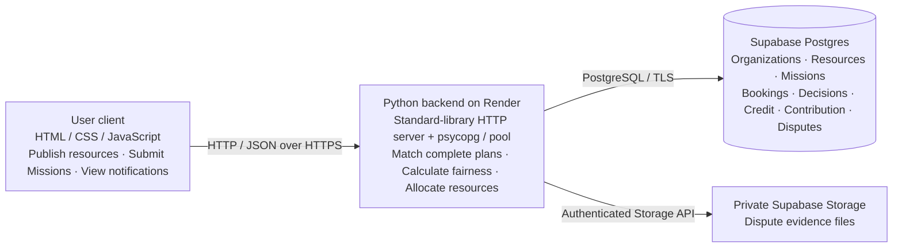

# Campus Commons

**Live demo: [https://campus-commons.onrender.com](https://campus-commons.onrender.com)**

**2026 Hackathon HackU · Team She++**

**Financial Technology Problem 2 — Recognise Value That Gets Overlooked**

## Start with the website

1. Open <https://campus-commons.onrender.com>.
2. Use the organization selector to choose a demonstration organization. This is a demo identity switch, not a real account login.
3. Browse **Resources**, publish a resource, or submit a **Mission**.
4. View the Mission's plans and save acceptable plans in your preferred order before its cutoff.
5. After allocation, inspect the approved resources, notifications, organization profile and history.

For the administrator demonstration, press **Alt/Option + Shift + A**, sign in with the owner's private admin password, then use **Dashboard → Run allocation batch** or **Demo tests → Run all scenarios**. Manual Run changes real records and can run before cutoff; Demo studio is an isolated teaching animation. [Full admin instructions](#administrator-workflow) include automatic scheduling and recording controls.

The shared demo contains sample data. Actions on this site change shared records. Use a separate test database or local demo for repeatable judging scenarios.

## Our story: the value is already on campus

A society has a camera sitting idle. A makerspace has spare equipment, and another organization has a room available. Across campus, a student team still spends time asking group chats for help or pays to rent what the community already owns. The missing piece is a process that makes that capacity visible, combines it into a workable plan, and settles who gets access when demand overlaps.

**Campus Commons connects that process.** Providers publish equipment, spaces, skills and people capacity. A requester describes a Mission, receives complete resource combinations and ranks acceptable plans. At cutoff, a transparent fairness rule decides whose Mission is considered first, then respects that requester's preference order. Providers retain ownership; borrowers receive temporary access. Sharing, bookings and reliability become persistent records instead of disappearing into chat history.

The difficult case matters as much as the successful match. When two organizations need the same camera, the platform explains allocation and waitlisting. When a requester withdraws, capacity is released and can be reconsidered. When a provider fails or a dispute arises, evidence, review, credit and resolution records make the responsibility visible. This is the economic activity we support: using overlooked capacity more effectively, with an explicit rule for conflict.

The English MVP is deployed for public browser use. **It currently uses demo organizations/data; no real-user savings, adoption or revenue have been validated.** The dashboard makes assumptions visible rather than proving a commercial outcome. Public visitors do not need Python, a private `.env` or direct database access.

[Official problem statements](docs/problem-statements/HacKU_2026_Problem_Statements.pdf) · [Requirement coverage and live evaluation](docs/REQUIREMENTS_AND_EVIDENCE.md) · [Current project overview](docs/overview/README.md)

## How this answers the FinTech challenge

| Requirement from Problem 2 | Our implementation | What a reviewer can inspect |
| --- | --- | --- |
| Recognise overlooked economic value | Turn idle organization resources and time into discoverable, bookable capacity. | Resources, availability, capacity, owners and the Impact dashboard. |
| Define what is contributed or exchanged and who benefits | Providers offer temporary resource access; borrowers can avoid finding or renting equivalent resources elsewhere. | Resource publishing, complete Mission Plans, bookings and contribution records. |
| Define a fairness rule | Rank eligible Missions by urgency, contribution, reliability, past access and scarcity of alternatives; consider each requester's ranked plans. | Allocation decisions and policy snapshots; admin fairness settings. |
| Demonstrate a disagreement, withdrawal or imbalance | Handle competition, withdrawals, unavailable providers/resources and evidence-backed disputes. | Live status changes, released bookings, credit events, compensation review and history. |
| Show more than one case and explain the trade-off | Four animated teaching scenarios plus repeatable live evaluation steps. | [Evaluation guide](docs/REQUIREMENTS_AND_EVIDENCE.md#repeatable-live-evaluation) and admin Demo studio. |
| State where the arrangement breaks | Explain scarcity, inaccurate inputs, verification gaps and deployment limits. | [Limitations](#limitations-and-boundaries) below. |

No currency, token, blockchain or payment system is required for this solution. Credit is a reliability score, not money or a transferable balance.

## How the platform works

**A shared cloud-backed MVP built for multi-user collaboration.** The user interface and admin console communicate with one Python backend. Supabase Postgres holds shared business records; Supabase Storage holds private dispute evidence.



**From local files to a public platform:** local project version → GitHub → Render deployment → public website. The deployed client calls the hosted backend; database and Storage secrets stay server-side. Users read/write the same Supabase project through the backend, so business data persists across browsers and machines. Trusted collaborators can also run a private local backend against the same test project using the owner's configuration; ordinary visitors use the public URL.

The business sequence is **publish capacity → submit Mission → generate complete plans → rank preferences → reach cutoff → fairness batch → allocate/waitlist → use/complete or resolve a conflict → record contribution, credit and history**.

## User workflow

### Publish and maintain resources

Choose **Resources → Publish resource**. Enter the resource name, type (`equipment`, `space`, `skill` or `people`), capability, location, availability start/end and capacity. Add condition, features and hourly value/cost references as appropriate. Use the organization profile to edit your own resources or change their status.

Availability hours and completed sharing hours feed contribution records. The current MVP marks published resources as verified in its database; it does not independently verify ownership, capabilities or professional qualifications.

### Submit a Mission and rank complete plans

Choose **Missions → Submit a Mission**. Enter a title, a description of the needed capabilities, location and usage start/end. Select the required resource types where available.

The backend uses deterministic keyword rules, not an LLM, to parse requirements. It checks resource type, capability fit, the requested time window and remaining booking capacity, then proposes up to five complete plans. Each plan must contain every parsed requirement. If no complete plan is feasible, the Mission has no valid options; it does not mean that resources have been reserved.

Open **View details**, select acceptable plans, reorder them and **Save option preferences**. Submission and preference saving do not create bookings. The default cutoff is **usage start minus 24 hours**; API clients may supply a custom cutoff before usage start. The normal user form uses the default.

### Allocation, use and completion

At cutoff, an enabled scheduler processes eligible open/waitlisted Missions. It chooses the first feasible plan in each Mission's saved preference order, reserves its resources and changes the Mission to `allocated`; otherwise the Mission is `waitlisted`. Existing confirmed bookings cannot be displaced by a later urgent request.

The requester can check out and complete the allocated Mission. Completion closes active bookings and adds actual sharing hours for providers. The booked time window is used for these hours; they are not independently measured physical usage.

A requester can withdraw a Mission, releasing its active bookings. In the current live implementation, requester withdrawal records a **−3** credit event, including withdrawal before allocation. Eligible waitlisted Missions are reconsidered on a subsequent batch; the release itself does not guarantee immediate reassignment.

### Disputes and replacement confirmation

From Mission details, submit a dispute with a description, the provider at fault where applicable, evidence and an optional compensation request. Up to **five evidence files**, each up to **10 MB**, are accepted. In cloud mode evidence is uploaded to a private Supabase Storage bucket; the database retains metadata/object paths. The local demo can retain evidence as data URLs.

An administrator reviews the dispute. Approved compensation can suspend the provider until the affected organization confirms resolution; another unresolved approved compensation dispute keeps the provider suspended. Compensation is recorded, not paid through the platform.

Making an allocated resource unavailable can release affected reservations and flag a replacement as pending. The requester must confirm acceptable replacement preferences before a later batch can allocate them; the backend does not silently accept alternatives. The live **provider no-show** admin action records **−8** credit, releases active bookings and marks the Mission completed. It is distinct from the scripted replacement story in Demo studio.

## Administrator workflow

### Open and sign in

From the public/user page, press **Alt + Shift + A** (Windows/Linux) or **Option + Shift + A** (macOS). The admin console opens as an opaque overlay on the same website. Direct `/admin` navigation returns the user shell.

Use the password configured by the owner:

- Hosted deployment: `CAMPUS_ADMIN_PASSWORD` in Render's environment settings.
- Double-click startup: that environment value, or the locally generated `.launcher-admin-password` if omitted.
- Direct local `server.py`: that environment value, or `.admin-password`. If no password file exists, run `python3 -c "import server; server.admin_password()"` once in the project folder (`python` on Windows) to generate it without printing the password, then view the file privately. The server also creates it on the first sign-in password check.

Generated passwords are private local files, not repository contents. Do not use a password from an old checkout/history for the hosted service. The shortcut only opens the console; protected admin APIs still require an authenticated admin session.

### Manual and automatic allocation

**Dashboard → Run allocation batch** deliberately processes the current open/waitlisted queue immediately, even before cutoff. This is useful for a live demonstration and changes real test records.

Automatic allocation is configured at:

**Demo tests / Demo studio → expand “Scheduler and policy settings” → Scheduler: Automatic → Save settings**

Use the same panel to change the check interval (UI minimum 30 seconds; default 300) and the five fairness weights. **Manual** disables background allocation. Automatic allocation occurs on the next scheduler check **after cutoff**, normally T−24h relative to usage start; it is not 24 hours before the cutoff. Changing settings does not wake an already sleeping scheduler immediately: allow its previous check interval to elapse.

Both local and Render entrypoints start the scheduler thread. The process must remain running. A stopped/sleeping host does not run jobs; after it resumes, the next check processes due Missions. Keep one active scheduling backend for a shared test database.

### Demo studio and recording

Open **Demo tests** and choose **Run all scenarios** or one of four cases:

1. Competition for one scarce resource: fairness ranking, allocation and waitlist.
2. Withdrawal before the batch: a request leaves without reserving capacity.
3. Provider failure and replacement: explain why a requester must confirm an alternative.
4. Ranked preferences: skip infeasible Plan A and consider Plan B in the same batch.

The player runs locally using preloaded frames. Use **Recording view**, **Pause**, **Back**, **Next**, **Restart**, numbered steps and the 3/5/8-second speed controls. Written reports and scheduler/policy settings are collapsed below the player.

These are **scripted teaching scenarios**, not executed live allocation tests. A run stores a report in `demo_runs` but does not change live resources, Missions, bookings, credit or contribution. Scenario assertions are explanatory report content, not proof of engine correctness. For example, the teaching no-show story uses a −5 illustration while the live action uses −8. Use the [live evaluation procedure](docs/REQUIREMENTS_AND_EVIDENCE.md#repeatable-live-evaluation) alongside the animation when presenting evidence.

## Matching and fairness rules

Matching determines whether a plan can work; fairness determines whose Mission is considered first.

- **Matching score:** 60% capability token fit + 20% feasible time + 20% location-text fit, after type/time/capacity checks. Location ranking is a text similarity heuristic, not routing or a guaranteed distance restriction.
- **Fairness:** `0.30 × urgency + 0.20 × contribution + 0.15 × credit + 0.20 × access_fairness + 0.15 × alternative_scarcity` with configurable admin weights.
- **Urgency:** rises as the Mission's cutoff approaches; it is bounded over a seven-day horizon.
- **Contribution:** `0.8 × min(shared_hours / 40, 1) + 0.2 × min(available_hours / 80, 1)`.
- **Credit:** current reliability score divided by 100, clipped to 0–100 when events change it.
- **Access fairness:** higher for organizations with fewer past allocation wins; an organization with no allocation history starts at 0.9.
- **Alternative scarcity:** higher when there are fewer generated complete plans (maximum five).

Missions are sorted by descending fairness score; deadline breaks score ties. Within each Mission, the saved plan order is respected, and booking capacity/time conflicts are rechecked. Suspended organizations are ineligible. A credit score below 70 alone does **not** exclude an organization; this differs from the early planning draft.

**Who is protected:** organizations with fewer past opportunities, fewer alternatives, urgent needs and sustained contributions. **Who bears the cost:** an earlier applicant or an organization with stronger credit can lose its first choice; newcomers have less historical contribution to draw on. The greedy ranking does not guarantee the maximum number of satisfied Missions or an optimal allocation across all preference lists. See [trade-offs and failure conditions](docs/REQUIREMENTS_AND_EVIDENCE.md#trade-offs-and-failure-conditions).

## Economic value and revenue roadmap

The Impact dashboard makes sharing visible through bookings, shared hours and estimated avoided external costs. These figures describe demo database records and assumptions, not measured savings for real people:

- Estimated avoided external cost: sum of active/completed booking hours × quantity × the resource's reference external hourly cost (falling back to its hourly value when needed).
- Estimated coordination time saved: **1.5 hours per resource booking + 0.5 hours per distinct Mission**; this is a heuristic, not measured time.
- The separate completed-booking cost metric includes completed bookings only; it can differ from the Impact total.
- Actual sharing contribution is recorded on completion. Active bookings are planned/shared commitments, not proof of completed use.

The intended early phase is free access while testing whether borrowers save time and rental costs. After an active community is established, relevant advertising/sponsorships could be explored; optional paid analytics and organization tools could follow while keeping core sharing free. **Advertising, click-based revenue, memberships and payment collection are not implemented or validated.**

## Run the code locally

### Local demo without cloud credentials

Requires Python 3.10 or newer. Clone or download `main`, extract the ZIP, and open a terminal in the folder containing `server.py`:

```bash
git clone https://github.com/mayoix/campus-commons.git
cd campus-commons
python3 server.py
```

On Windows, use `python server.py`. Open <http://127.0.0.1:8765/> and keep the terminal open. Stop with `Ctrl+C`.

With no cloud configuration, the server creates and seeds `campus_commons.sqlite3` automatically; no committed database file is needed. Existing local data is preserved and migrations add missing schema. SQLite, backups and generated password files are ignored by Git.

If your folder already has a cloud `.env`, explicitly choose SQLite for this local run:

```bash
# macOS / Linux
CAMPUS_DB_BACKEND=sqlite python3 server.py
```

```powershell
# Windows PowerShell
$env:CAMPUS_DB_BACKEND = "sqlite"
python server.py
```

`server.py` loads `.env` from the project root; explicit environment variables take precedence. If `SUPABASE_DATABASE_URL` is configured, the default mode is Supabase unless overridden.

### Trusted collaborator: double-click cloud startup

Receive one private `.env` from the owner and put it **next to `start.py`**, not inside `static/` or `docs/`. Install Python 3.10+ first, then:

- **Windows:** double-click `Start Campus Commons.bat`.
- **macOS:** run `chmod +x "Start Campus Commons.command"` once if needed, then double-click it.
- **Linux or terminal fallback:** run `python3 start.py` (`python start.py` on Windows).

The launcher prepares `.venv`, installs cloud dependencies when needed, starts the server and opens the browser after shared data loads. Keep the launcher window open. The launcher's cloud mode needs completed database and Storage configuration; it does not fall back silently to SQLite and does not run a data migration.

If a reused `.venv` predates connection pooling and reports missing `psycopg_pool`, install the current dependencies and restart:

```bash
# macOS / Linux
.venv/bin/python -m pip install -r requirements-cloud.txt
```

```powershell
# Windows
.\.venv\Scripts\python.exe -m pip install -r requirements-cloud.txt
```

For the exact private configuration format, encrypted delivery, owner setup and a two-person test, see [Supabase collaboration setup](docs/guides/SUPABASE_SETUP.md).

## Deployment and data

```text
Browser user app / admin overlay
              ↓ HTTP JSON
      Render Python backend
              ↓
 Supabase Postgres — shared business records
 Supabase private Storage — dispute evidence
```

Render uses `pip install -r requirements.txt` and `python render_start.py`, as declared in `render.yaml`. Set `CAMPUS_DB_BACKEND=supabase`, `SUPABASE_DATABASE_URL`, `SUPABASE_URL`, `SUPABASE_SECRET_KEY`, `SUPABASE_EVIDENCE_BUCKET` and a private `CAMPUS_ADMIN_PASSWORD` in Render. Render supplies `PORT`. Copy the database URI from the Supabase Connect dialog; credentials remain on the backend.

Startup applies the current schema and performance indexes and seeds an empty database. Existing business records are preserved by schema setup, with compatibility backfills. Starting another checkout against the shared database therefore is not strictly read-only. Only the owner should intentionally migrate an older local database; see the [migration guidance](docs/guides/SUPABASE_SETUP.md#owner-only-data-migration).

PostgreSQL requests reuse one connection pool with compatible row adapters. Resource/Mission lookups are batched. Background clients check `/api/version` and reload snapshots only after persistent changes; hidden tabs pause polling, and the user app pauses while its admin overlay is open. Cloud reads use independent transactions while writes/allocation retain a process-local lock. `db_pool.py` preserves compatibility entrypoints; `server.py` owns the actual pool.

## Validation and troubleshooting

Run the offline regression suite from the repository root after installing dependencies:

```bash
python3 -m pip install -r requirements.txt
python3 -m unittest discover -s tests -v
```

The current suite has **21 tests** covering launcher behavior, credential-safe diagnostic failures, pool commit/rollback, PostgreSQL row compatibility, serializer equivalence and isolated teaching reports. A query-count regression keeps user bootstrap at **20 queries** even after adding 40 resources and 40 Missions. A comparison against `fdfb903` on that fixture reduced user/admin bootstrap queries from 115/158 to 20/25; these are query counts, not production timing guarantees.

Local HTTP checks exercised organization switching, resource publishing, Mission submission, manual allocation and admin/version reads. Two additional fresh-database business cases verified capacity-one competition and withdrawal followed by waitlist allocation; [recorded results](docs/REQUIREMENTS_AND_EVIDENCE.md#recorded-local-business-flow-verification) distinguish these from teaching frames. Browser checks verified the opaque admin overlay and return to the user interface. These do not establish successful production Supabase connectivity or real-user economic outcomes.

| Symptom | Action |
| --- | --- |
| Private `.env` is missing or still contains placeholders | Get the completed owner configuration; place it beside `start.py`. Public website visitors need no `.env`. |
| Missing `psycopg_pool` in a reused launcher environment | Reinstall `requirements-cloud.txt` using the `.venv` command above, then restart. |
| Cloud startup times out or returns a database error | Check project status, exact pooler URI, password, TLS, network access and other running backends. Run the optional diagnostic below. |
| Port is already in use | Close the earlier launcher/server or change `PORT` in `.env`. |
| No plans are generated | Check selected resource types, capability descriptions, availability and active booking capacity. |
| Manual allocation does not happen automatically | Enable Automatic in the collapsed scheduler settings and save; ensure the backend stays running. |
| Preferences are locked | The cutoff has passed; pending replacement confirmation is handled separately. |
| Evidence upload fails | Check the server-only Storage key and private bucket permissions; the optional diagnostic expects the bucket to exist. |
| Old page styling remains after deployment | Refresh after Render deploys the latest commit; use a hard refresh if cached assets remain. |

Optional read-only cloud diagnostic: `python3 scripts/check_connection.py`. It checks verified-TLS database access and the private evidence bucket; it does not migrate or upload data. Share only its PASS/FAIL summary, never credentials. Automatic scheduling is flagged by this diagnostic for multi-backend collaborator testing because the process-local allocation lock is not shared across servers.

## Limitations and boundaries

Organization selection is a demonstration feature, not verified membership or production authentication. Admin sessions are process-local and disappear on restart. The prototype is not ready for confidential production data without real authentication, authorization and stronger request validation.

Availability, capability, urgency and price references can be inaccurate or manipulated. Fairness weighting cannot eliminate scarcity, validate a physical item or guarantee truthful requests. Keyword parsing and location text matching are deliberately limited. The platform does not implement identity verification, payment settlement, blockchain, real-time push or an independently deployed allocation worker.

The in-process scheduler and write lock do not coordinate multiple backend instances. Do not run independent active schedulers against one database for production allocation; a database-coordinated worker is future work. History/decision records support inspection but are not a tamper-proof ledger. Tests and demonstrations are prototype evidence, not a real-user study.

Private `.env`, database files and generated passwords are excluded from current Git tracking. Historical commits may still contain the old demo password/data; removing files from `main` does not erase history. Use a new private hosted admin password.

## Repository layout

```text
README.md                      Project, requirements, use and implementation
server.py                      API, business logic, pooled database adapter
start.py                       Trusted collaborator launcher
Start Campus Commons.bat       Windows double-click entrypoint
Start Campus Commons.command   macOS double-click entrypoint
render_start.py / render.yaml   Hosted entrypoint and Render configuration
db_pool.py                     Pool compatibility entrypoints
requirements*.txt / .env.example
static/                        English user interface and admin overlay
scripts/                       Diagnostics, migration, indexes, Demo frames
tests/                         Offline regression tests
docs/
  REQUIREMENTS_AND_EVIDENCE.md  Official challenge mapping and live evaluation
  problem-statements/          Official statement and team planning draft
  overview/                   Current summary and historical Word overview
  guides/SUPABASE_SETUP.md     Private collaborator setup and migration
```

Runtime entrypoints remain at the root so Render, launchers and imports retain their existing paths. Local databases, backups, `.venv`, caches and private configuration are generated locally and not distributed in the repository. The archived planning PDF and Word overview describe earlier versions; this README and the current source define the final MVP's behavior.

## Team

2026 Hackathon HackU · Team She++ · ZHENG Ruixue · ZHU Yining · SUN ZI DAN · TANG Tian Yi
